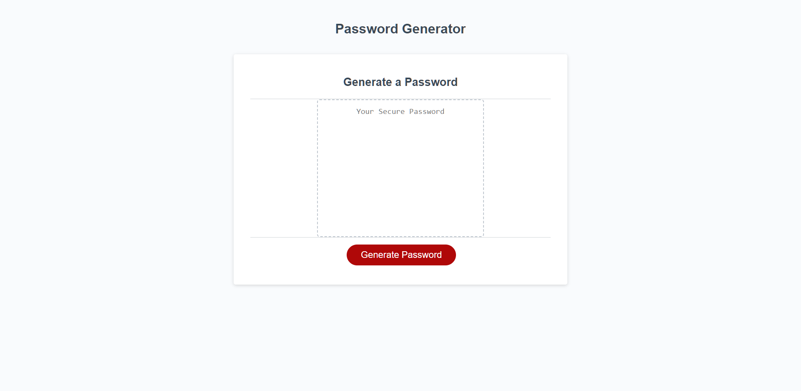

# Password Generator

## What is this project?
This is a website that can assist a client when creating a password. The website prompts the client for certain character criteria and validates each of their choices. Once all the prompts have been answered, a password is outputted to the screen. I have also included a list of all the criteria that the client had entered as a reminder for easy comparison.

## This project targeted a few objectives:
* What the "Generate Password" button is clicked, a series of prompts for password criteria are displayed. The client can then choose which criteria they would like in their password
* The client can choose the length of their password, from 8 to 128 characters
* When asked for character types to include in the password, they can confirm whether or not to include lowercase, uppercase, numeric, and/or special characters 
* When the client answers each prompt, each response is validated
* When all password prompts are answered, the password is generated that matches the selected criteria
* The password is then displayed on the page, with friendly reminders of their prompt selections

The following is a link to the GitPages site:
 [JavaScript Quiz Website](https://kenny4297.github.io/Password-Generator/)

The following is a screen shot of the final product:
